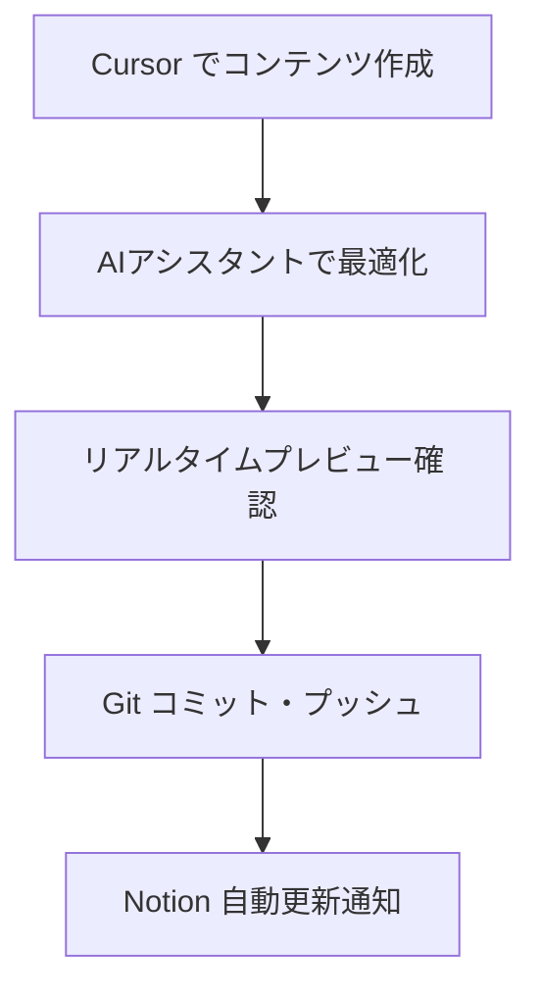
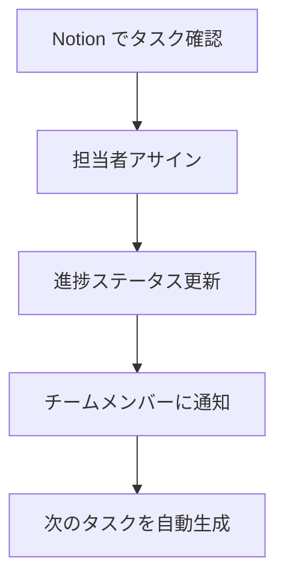

# 🚀 Notion × Cursor チームプロジェクト管理プラン

## 📋 **全体構成概要**

### 🎯 **目標**
- Notionでリアルタイムチーム協働
- Cursorで効率的なコンテンツ開発
- 自動化による作業効率最大化
- 透明性の高いプロジェクト進捗管理

---

## 🏗️ **Notion ワークスペース構造**

### 📊 **1. メインダッシュボード**
```
🏠 秘書力マスター講座 ローンチHQ
├── 📅 9月ローンチ カレンダービュー
├── 📈 KPI・進捗トラッカー  
├── 👥 チームメンバー・役割
├── 🚨 緊急タスク・アラート
└── 📝 今日のアクション
```

### 📅 **2. 日次スケジュール管理**
```
📋 9月ローンチ 日次タスク管理
├── カレンダービュー（月間俯瞰）
├── ボードビュー（ステータス別）
├── リストビュー（担当者別）
└── ガントチャートビュー（依存関係）
```

### 👥 **3. チーム協働エリア**
```
🤝 チームコラボレーション
├── 💬 デイリースタンドアップ
├── 📝 ミーティング議事録
├── 💡 アイデア・改善提案
├── 🔄 フィードバック・レビュー
└── 📚 ナレッジベース
```

### 📁 **4. コンテンツ管理**
```
📝 コンテンツ制作管理
├── X投稿 コンテンツバンク
├── LINE配信 原稿管理
├── スタエフ 台本・音源
├── 画像・動画素材ライブラリ
└── ブランドガイドライン
```

---

## ⚙️ **Cursor × Notion 連携ワークフロー**

### 🔄 **開発・更新フロー**

#### **Step 1: Cursor での作業**


#### **Step 2: Notion での管理**


### 🛠️ **Cursor 活用テクニック**

#### **1. AIペアプログラミング**
- **コンテンツ生成：** 「9月2日のX投稿文を3パターン作成して」
- **最適化：** 「この文章をより魅力的に書き直して」
- **一括処理：** 「全ての日付のテンプレートを一括生成」

#### **2. 自動化スクリプト**
- **ファイル同期：** Notion API連携スクリプト
- **進捗更新：** Git hooks でNotion自動更新
- **レポート生成：** 日次・週次レポート自動作成

#### **3. コード補完・生成**
- **テンプレート生成：** 投稿文テンプレートの自動生成
- **データ処理：** CSV・JSON形式での進捗データ出力
- **API連携：** SNS投稿の自動化スクリプト

---

## 📋 **Notion データベース設計**

### 🗓️ **日次タスクデータベース**

| プロパティ | タイプ | 説明 |
|------------|--------|------|
| 📅 日付 | Date | 実行日 |
| 📝 タスク名 | Title | タスクの内容 |
| 👤 担当者 | Person | アサインされた人 |
| 🏷️ カテゴリ | Select | X投稿/LINE/スタエフ/面談 |
| ⭐ 優先度 | Select | 高/中/低 |
| 📊 ステータス | Select | 未着手/進行中/レビュー中/完了 |
| ⏰ 予定時間 | Number | 作業予定時間（分） |
| ⏱️ 実績時間 | Number | 実際の作業時間（分） |
| 📝 メモ | Text | 進捗・課題・備考 |
| 🔗 関連ファイル | Files | 関連する画像・動画・文書 |

### 👥 **チームメンバーデータベース**

| プロパティ | タイプ | 説明 |
|------------|--------|------|
| 👤 名前 | Title | メンバー名 |
| 🎯 役割 | Select | コンテンツ/運営/デザイン |
| 📧 連絡先 | Email | メールアドレス |
| ⏰ 稼働時間 | Text | 対応可能時間帯 |
| 🛠️ スキル | Multi-select | 得意分野・スキル |
| 📊 現在のタスク | Relation | 担当中のタスク |
| 📈 完了率 | Formula | タスク完了率 |

### 📊 **KPI トラッキングデータベース**

| プロパティ | タイプ | 説明 |
|------------|--------|------|
| 📅 日付 | Date | 計測日 |
| 📱 X フォロワー | Number | フォロワー数 |
| 📧 LINE 登録者 | Number | 登録者数 |
| 👀 エンゲージメント | Number | いいね・コメント数 |
| 📞 問い合わせ数 | Number | 問い合わせ件数 |
| 💰 申込み数 | Number | 講座申込み数 |
| 📝 メモ | Text | 特記事項・分析 |

---

## 🤖 **自動化・連携設定**

### 🔗 **Notion API 連携**

#### **1. 自動タスク生成**
```javascript
// 毎日のルーティンタスクを自動生成
const dailyTasks = [
  { name: "X投稿確認", category: "SNS", priority: "高" },
  { name: "LINE配信状況確認", category: "LINE", priority: "中" },
  { name: "数値チェック", category: "分析", priority: "中" }
];
```

#### **2. 進捗自動更新**
```javascript
// Git コミット時にNotion自動更新
webhook.on('push', (data) => {
  updateNotionTask(data.commit.message);
});
```

### 📱 **Slack/Discord 連携**
- **進捗通知：** タスク完了時の自動通知
- **アラート：** 遅延タスクの警告
- **デイリーレポート：** 毎日の進捗サマリー

### 📊 **分析・レポート自動化**
- **週次レポート：** KPI推移の自動グラフ生成
- **チーム効率分析：** 作業時間・完了率の可視化
- **ボトルネック検出：** 遅延要因の自動特定

---

## 📱 **モバイル・リモート対応**

### 📲 **Notion モバイルアプリ活用**
- **外出先での確認：** リアルタイム進捗チェック
- **音声メモ：** 移動中のアイデア記録
- **写真アップロード：** 現場での素材収集

### 💻 **Cursor リモート開発**
- **クラウド同期：** どこからでも最新ファイルにアクセス
- **ペアプログラミング：** リアルタイム共同編集
- **AIアシスタント：** 24時間サポート

---

## 🎯 **実装ロードマップ**

### 📅 **Week 1: 基盤構築**
- [ ] Notion ワークスペース設計・構築
- [ ] データベース作成・設定
- [ ] チームメンバー招待・権限設定
- [ ] 基本テンプレート作成

### 📅 **Week 2: 連携・自動化**
- [ ] Cursor - Notion API連携設定
- [ ] 自動化スクリプト開発・テスト
- [ ] Slack/Discord 通知設定
- [ ] モバイルアプリ設定・テスト

### 📅 **Week 3: 運用開始・調整**
- [ ] チーム研修・操作説明
- [ ] 実際の運用開始
- [ ] フィードバック収集・改善
- [ ] 追加機能・カスタマイズ

### 📅 **Week 4: 最適化・拡張**
- [ ] 運用データ分析・最適化
- [ ] 追加自動化の実装
- [ ] レポート機能強化
- [ ] 9月ローンチに向けた最終調整

---

## 🛡️ **セキュリティ・バックアップ**

### 🔒 **アクセス管理**
- **役割別権限：** 編集/閲覧権限の細かい設定
- **ゲストアクセス：** 外部パートナー用の限定アクセス
- **監査ログ：** 全ての変更履歴を記録

### 💾 **データバックアップ**
- **自動バックアップ：** 日次でのデータエクスポート
- **バージョン管理：** 重要ファイルのGit管理
- **復旧手順：** 緊急時の復旧プロセス

---

## 📊 **成功指標・KPI**

### 🎯 **プロジェクト管理効率**
- **タスク完了率：** 95%以上
- **期限遵守率：** 90%以上
- **チーム満足度：** 4.5/5以上

### 📈 **ローンチ成果**
- **LINE登録者増加：** 月+125名
- **申込み数：** 18名達成
- **チーム作業効率：** 30%向上

---

## 🚀 **次のアクション**

### 🔥 **今すぐ実行**
1. **Notion ワークスペース作成**
2. **チームメンバー招待**
3. **基本データベース構築**
4. **Cursor での開発環境準備**

### 📋 **今週中に完了**
1. **全データベース設計・構築**
2. **基本的な自動化設定**
3. **チーム研修・説明会**
4. **運用ルール策定**

---

**作成日：** 2025年1月  
**担当者：** あやねえ + 開発チーム  
**次回レビュー：** 毎週金曜日
