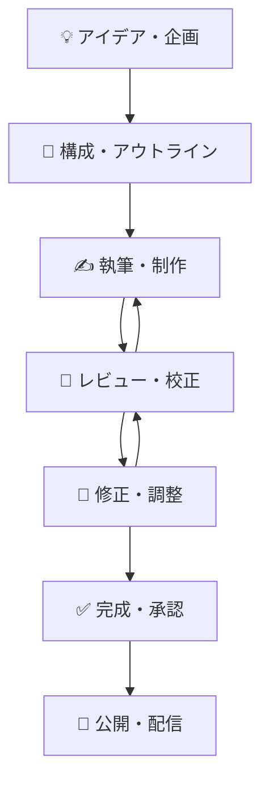

# 📚 レッスンコンテンツ制作ワークフロー

## 🎯 **制作フローの全体像**



---

## 📋 **レッスンコンテンツデータベース設計**

### 🗂️ **メインデータベース: レッスン制作管理**

| プロパティ名 | タイプ | 設定内容 | 説明 |
|--------------|--------|----------|------|
| 📝 レッスン名 | Title | - | メインタイトル |
| 📖 章番号 | Select | 第1章〜第9章 | 所属する章 |
| 🏷️ カテゴリ | Select | ガイダンス/マインド/脱サラ/コミュニケーション/時短/家事育児/SNS/事例/マネタイズ | レッスンの種類 |
| 👤 担当者 | Person | チームメンバー選択 | 主担当者 |
| 📊 ステータス | Select | アイデア/構成中/執筆中/レビュー中/修正中/完成/公開済み | 制作段階 |
| ⭐ 優先度 | Select | 🔴高/🟡中/🟢低 | 重要度・緊急度 |
| 📅 期限 | Date | - | 完成予定日 |
| ⏰ 予定工数 | Number | 時間（分） | 作業予定時間 |
| ⏱️ 実績工数 | Number | 時間（分） | 実際の作業時間 |
| 📈 進捗率 | Number | 0-100% | 完成度 |
| 🎯 学習目標 | Text | - | このレッスンで学べること |
| 📝 概要・メモ | Text | - | 内容の概要・注意点 |
| 🔗 関連ファイル | Files & media | - | 原稿・画像・動画 |
| 🏷️ タグ | Multi-select | 実践ワーク/事例紹介/ツール紹介/マインドセット | 内容の特徴 |
| 📊 難易度 | Select | 初級/中級/上級 | 受講生のレベル |
| ⏳ 所要時間 | Number | 分 | 受講にかかる時間 |
| 🔄 関連レッスン | Relation | → 他のレッスン | 前後のつながり |

### 🎨 **ステータス別の色分け**
- **💡 アイデア**: 薄紫（アイデア段階）
- **📝 構成中**: 薄青（構成・設計中）
- **✍️ 執筆中**: 薄黄（制作作業中）
- **👀 レビュー中**: 薄オレンジ（確認待ち）
- **🔄 修正中**: 薄赤（修正作業中）
- **✅ 完成**: 薄緑（完成・承認済み）
- **🌟 公開済み**: 濃緑（リリース済み）

---

## 📊 **ビュー設定（使いやすさ重視）**

### 1️⃣ **📋 制作状況ボード（メインビュー）**
```
アイデア → 構成中 → 執筆中 → レビュー中 → 修正中 → 完成 → 公開済み
   💡       📝       ✍️       👀        🔄      ✅      🌟
   3件      2件      5件      3件       1件     8件     15件
```
- **グループ化**: ステータス別
- **並び順**: 優先度 → 期限
- **色分け**: ステータス別の色

### 2️⃣ **📖 章別一覧（構造把握）**
```
第1章 講座の使い方ガイダンス
├── ✅ コミュニティの活用方法（完成）
├── ✅ コンテンツの学び方（完成）
├── ⏳ ロードマップ作成（執筆中）
└── 📝 目標設定（構成中）

第8章 事例で学ぶサポート力＆提案力強化
├── ✅ お土産の選び方（完成）
├── ⏳ スプレッドシート術（執筆中）
└── 💡 AI活用術（アイデア）
```
- **グループ化**: 章番号別
- **並び順**: レッスン順序
- **進捗表示**: ステータスアイコン

### 3️⃣ **👤 担当者別（個人タスク管理）**
```
あやねえ
├── 🔴 AI活用術（高優先度・9/8期限）
├── 🟡 マネタイズ戦略（中優先度・9/15期限）

コンテンツ担当
├── 🔴 スプレッドシート術（高優先度・9/5期限）
├── 🟡 時短仕事術（中優先度・9/10期限）
```
- **グループ化**: 担当者別
- **フィルター**: 未完成のもののみ
- **並び順**: 優先度 → 期限

### 4️⃣ **📅 スケジュール（期限管理）**
- **レイアウト**: タイムライン
- **期間**: 期限日
- **色分け**: 優先度別
- **アラート**: 期限3日前に通知

### 5️⃣ **📊 進捗ダッシュボード**
```
📈 全体進捗
完成率: 68% (25/37レッスン)

📊 章別完成状況
第1章: ████████░░ 80% (8/10)
第2章: ██████░░░░ 60% (3/5)
第8章: ████░░░░░░ 40% (2/5)

🎯 今週の目標
- スプレッドシート術完成 ⏳
- AI活用術構成完了 📝
- 第1章全レッスン完成 🎯
```

---

## ✍️ **制作ワークフローの詳細**

### 💡 **Step 1: アイデア・企画**
**担当**: 主にあやねえ
**期間**: 1-2日
**作業内容**:
- [ ] レッスンの目的・ゴール設定
- [ ] ターゲット受講生の明確化
- [ ] 学習効果・成果の定義
- [ ] 他レッスンとの関連性確認

**成果物**:
- レッスン企画書（簡易版）
- 学習目標の設定
- 概要・メモの記入

### 📝 **Step 2: 構成・アウトライン**
**担当**: あやねえ + コンテンツ担当
**期間**: 2-3日
**作業内容**:
- [ ] レッスンの構成・流れ設計
- [ ] 必要な素材・事例の洗い出し
- [ ] 実践ワークの設計
- [ ] 所要時間の見積もり

**成果物**:
- 詳細アウトライン
- 必要素材リスト
- 実践ワーク設計書

### ✍️ **Step 3: 執筆・制作**
**担当**: 主にコンテンツ担当
**期間**: 3-5日
**作業内容**:
- [ ] 本文執筆
- [ ] 図表・画像の作成・選定
- [ ] 実践ワーク詳細作成
- [ ] チェックリスト作成

**品質基準**:
- あやねえらしい親しみやすい口調
- 具体例・事例を豊富に含む
- 実践しやすいステップ形式
- 読みやすい文章構成

### 👀 **Step 4: レビュー・校正**
**担当**: あやねえ（最終確認）
**期間**: 1-2日
**チェック項目**:
- [ ] 内容の正確性・妥当性
- [ ] 口調・文体の統一
- [ ] 誤字脱字チェック
- [ ] 学習目標との整合性
- [ ] 他レッスンとの重複確認

### 🔄 **Step 5: 修正・調整**
**担当**: コンテンツ担当
**期間**: 1-2日
**作業内容**:
- [ ] レビューコメントの反映
- [ ] 追加・削除・修正
- [ ] 最終調整・仕上げ

### ✅ **Step 6: 完成・承認**
**担当**: あやねえ（最終承認）
**期間**: 1日
**確認項目**:
- [ ] 最終品質チェック
- [ ] 公開準備完了確認
- [ ] 関連ファイル整理

### 🌟 **Step 7: 公開・配信**
**担当**: 運営担当
**期間**: 1日
**作業内容**:
- [ ] プラットフォームへのアップロード
- [ ] 受講生への案内
- [ ] 公開後の初期反応確認

---

## 🤖 **Cursor AI活用による効率化**

### ✍️ **執筆支援**
```
プロンプト例:
「第8章のスプレッドシート資料作成術のレッスンを作成してください。

条件:
- あやねえらしい親しみやすい口調
- 初心者でもわかりやすく
- 具体的な手順を含める
- 実践ワーク3つ含める
- 2000-3000文字程度

構成:
1. 学習目標
2. なぜスプレッドシートが重要か
3. 基本的な作成手順
4. 見やすくするコツ
5. 実践ワーク
6. チェックリスト」
```

### 🔍 **品質チェック**
```
プロンプト例:
「以下のレッスン内容をチェックして、改善点を教えてください。

チェック観点:
- 口調の一貫性（あやねえらしさ）
- 内容の分かりやすさ
- 実践しやすさ
- 誤字脱字
- 構成の論理性

[レッスン内容を貼り付け]」
```

### 📊 **関連性分析**
```
プロンプト例:
「このレッスンと関連する他のレッスンを分析して、
適切な順序や参照関係を提案してください。

対象レッスン: スプレッドシート資料作成術
既存レッスン一覧: [一覧を貼り付け]」
```

---

## 📱 **モバイル対応・外出先作業**

### 📲 **スマホでできること**
- **進捗更新**: ステータス変更
- **メモ追加**: アイデア・気づきの記録
- **音声入力**: 移動中の原稿作成
- **写真撮影**: 参考資料の収集

### 💻 **タブレットでできること**
- **構成作成**: アウトライン・マインドマップ
- **軽い執筆**: 短いセクションの作成
- **レビュー**: 内容確認・コメント追加
- **画像編集**: 簡単な図表作成

---

## 📊 **品質管理・標準化**

### ✅ **レッスン品質基準**
1. **学習目標の明確性**: 何を学べるかが明確
2. **実践性**: すぐに実行できる内容
3. **具体性**: 抽象的でなく具体的な手順
4. **親しみやすさ**: あやねえらしい温かい口調
5. **完結性**: そのレッスンだけで理解できる

### 📝 **テンプレート統一**
```markdown
# [レッスンタイトル]

## 🎯 学習目標
このレッスンを完了すると、以下ができるようになります：
- 
- 
- 

## 💡 なぜこのスキルが重要なのか？
[背景・重要性の説明]

## 📋 具体的な手順
### Step 1: 
### Step 2: 
### Step 3: 

## 💪 実践ワーク
### ワーク1: 
### ワーク2: 
### ワーク3: 

## ✅ 完了チェックリスト
- [ ] 
- [ ] 
- [ ] 

## 🔗 関連レッスン
- 前提レッスン: 
- 次のステップ: 
- 関連トピック: 

## 📚 参考資料・ツール
- 
- 
```

---

## 🚀 **運用開始手順**

### **Phase 1: セットアップ（1日）**
1. Notionデータベース作成
2. 既存レッスンの登録・ステータス設定
3. チームメンバーの役割確認

### **Phase 2: 運用開始（翌日から）**
1. 毎朝の進捗確認
2. 週2回の制作ミーティング
3. 完成レッスンの品質チェック

### **Phase 3: 最適化（2週間後）**
1. ワークフローの改善
2. テンプレートの調整
3. 効率化ツールの追加導入

---

## 📈 **成功指標・KPI**

### 🎯 **制作効率**
- **平均制作時間**: レッスン1本あたり8時間以内
- **品質スコア**: レビュー時の修正箇所3箇所以内
- **期限遵守率**: 90%以上

### 📊 **品質指標**
- **受講生満足度**: 4.5/5以上
- **完了率**: 80%以上
- **実践率**: 60%以上

これで、レッスンコンテンツ制作も含めた統合管理システムが完成です！直感的で使いやすく、品質も担保できる仕組みになっています！🎉

---

**作成日**: 2025年1月  
**担当者**: あやねえ + コンテンツチーム  
**次回更新**: 運用開始1週間後
